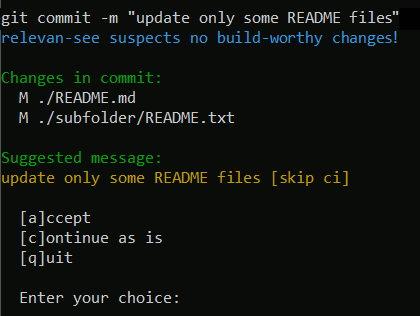

# Relevan-see

> [!CAUTION]
> I consider this a prototype that may have to be improved for enterprise use.

A Git `commit-msg` hook to determine if changes being committed are continuous integration (CI) build-worthy.

Why this name? It plays on the concept of "relevancy" and adds a visual twist, implying that the tool "sees" or evaluates the relevance of changes.

The tool checks if the current commit consists only of changes that do not require a CI run.
In this case, a string is inserted into the commit message to prevent build pipeline runs (default: ` [skip ci]`).

To decide this, two filters look at the changes:

1. The "ignorable" filter which considers certain file changes as not build-worthy. For example, changes to Markdown files (`.md`) would normally not require a pipeline run.
2. The "comments" filter which tries to determine if changes to a file only occur in comments. In such a case, the changes are also not considered build-worthy.

The tool is written in Go and produces a binary. To make use of it as the Git `commit-msg` hook, place the following content into `.git\hooks\commit-msg` of the repository and place the binary into `.git/hooks/`.

```sh
#!/bin/sh
# set RELEV_ARGS=--debug to debug
./.git/hooks/relevan-see $RELEV_ARGS $1 < /dev/tty
```

On commits, the check is performed, and the committer prompted if changing the commit message is suggested.

Setting `RELEV_ARGS=--debug` will output debug information when the hook is run.

The repository may also contain a `.relevan-see.json` configuration file in the root folder. By default [this configuration](./tool/config/default.json) is used. Run the tool without arguments to see all options.



## Building and testing

To build the tool run

	go build

To run the unit tests run

	go test ./...

## Hook installer

The folder [`hook-installer`](./hook-installer/) contains a Node-based convenience tool to install the hook.
